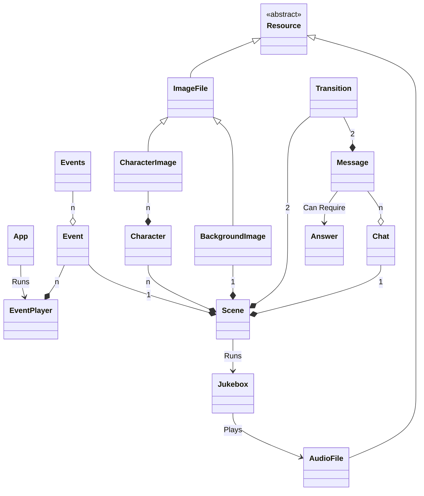

# Architecture

## UML

```mermaid
classDiagram
    App --> EventPlayer : Runs
    
    Event --* Scene : 1
    Event --* EventPlayer : n
    Events --o Event : n
    
    class Resource
    <<abstract>> Resource
    
    Resource <|-- AudioFile
    Resource <|-- ImageFile
    ImageFile <|-- BackgroundImage
    ImageFile <|-- CharacterImage
    
    Scene --> Jukebox : Runs
    Jukebox --> AudioFile : Plays
    
    Transition --* Message : 2
    Message --o Chat : n
    Message --> Answer : Can Require
    
    BackgroundImage --* Scene : 1
    CharacterImage --* Character : n
    Character --* Scene : n
    
    Chat --* Scene : 1
    Transition --* Scene : 2
    
    
    
    
    
```
