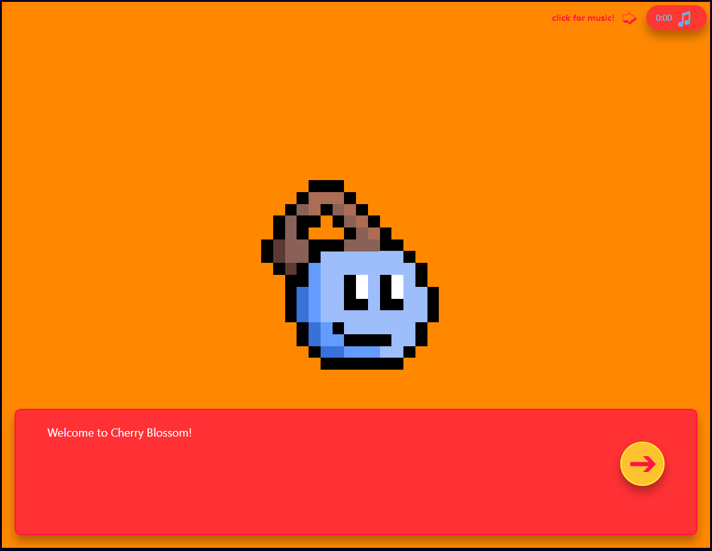
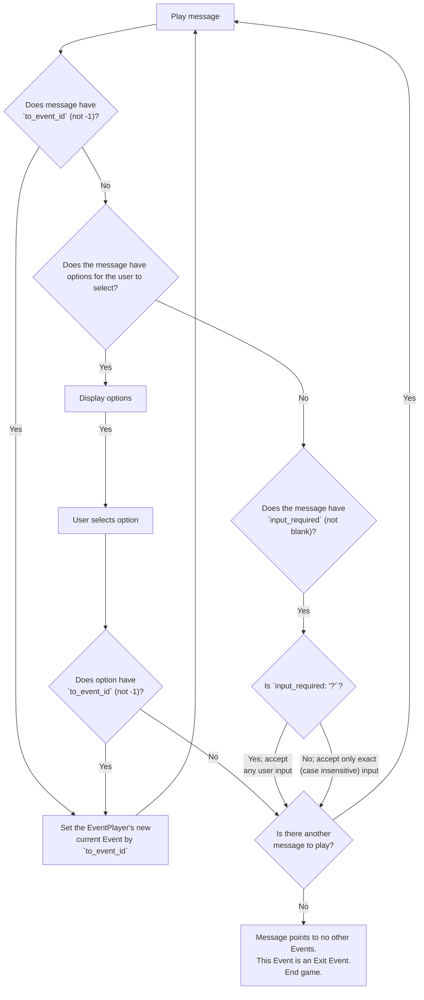
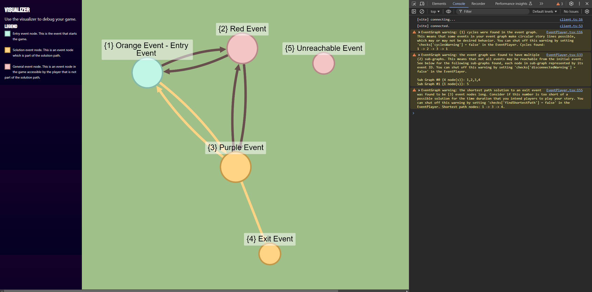
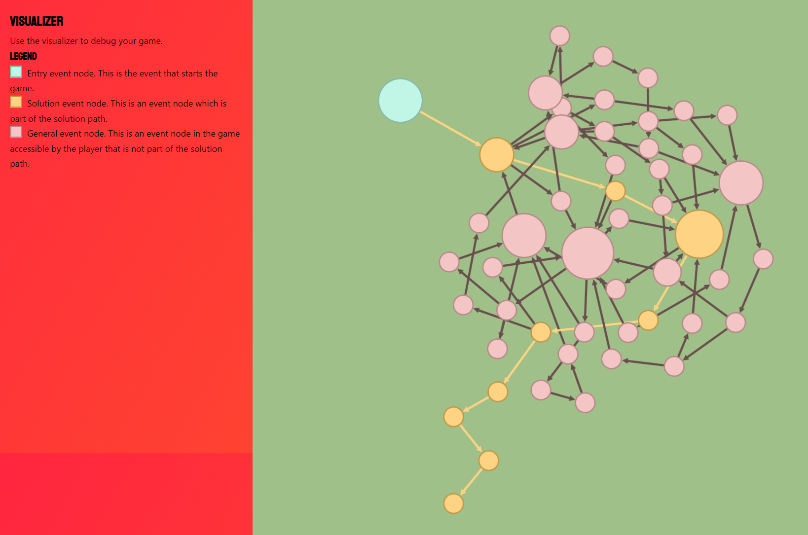

# Cherry Blossom



Cherry Blossom is a basic choose-your-adventure/visual novel engine built on [React](https://react.dev/) with [TypeScript](https://www.typescriptlang.org/).

[For the Love of Fieri](https://ftlof.wunderwizard.com/), a dating simulator where you play as Guy Fieri dating the hot 🌶️ foods around town, was built on Cherry Blossom.

CSS/Sass styling was done by [@victoria-jones](https://github.com/victoria-jones). See `ui/public/img` for art files, `src/styles` for Sass CSS files.

To view [Mermaid JS](https://mermaid.js.org/) diagrams in VSCode, install the [Markdown Preview Mermaid Support](https://marketplace.visualstudio.com/items?itemName=bierner.markdown-mermaid) extension.

The React TypeScript project folder "ui" was generated using Vite ("react" -> "react-ts"):
```powershell
npm create vite@latest ui
```

## Installation
To install the project, first install [Node](https://nodejs.org/en). Then, at the root of the project folder, do:
```powershell
cd ui
npm install
```

## Development
To run on localhost, with the "ui" folder still as current directory, do:
```powershell
npm run dev
```

Navigate to `http://localhost:3000` in the browser to view the app. The app will hot reload as game files are modified.

## Deployment
Run the following command to create build files in `ui/dist`:
```powershell
npm run build
```

Once complete, you can now share your game by copying the contents of the `dist` folder to a static web host of choice.

To preview the game locally from the build files, do:
```powershell
npm run preview
```

## Styling
The game is styled with CSS using [Sass](https://sass-lang.com/). The style of the game can be modified in the `ui/src/styles` folder.

## Data
The developer builds the game by modifying files in the `ui/src/data` folder. Note that all static content, such as `.mp3` and `.png` files, use the `public` folder as the root folder they are served out of; any file paths referencing these static files will assume all paths relative to `public` folder as root folder.

### Defining Characters
Characters are defined in `ui/data/Characters.tsx`, where art can be placed in `ui/public/img/character`. Here is an example of how to define a character:
```typescript
{
    "id": 1,
    "name": "Blue Cherry",
    "alignment": "left", // which side of the screen the character is on
    "description": "A cute blue cherry character", // character description (for developer, not shown to user)
    "img_path": "img/character/blue-cherry.png" // path to character image (for now, can only show one image; in future, this could be a map of image path by character emotion, so different image shows on different character emotion)
}
```

The main character in the game is aligned `left`, all other characters are aligned `right`.

### Defining Locations
Locations within the game are defined in `ui/data/Locations.tsx`. Background art can be placed in `ui/public/img/background`, background music can be placed in `ui/public/sounds`. Here is an example of how to define a location (without background music):
```typescript
{
    "id": 1, // location ID
    "name": "Orange", // location name (use this in the Event `location` parameter)
    "music_path": "", // path to background music of scene. Example: "sounds/clear_day.mp3"
    "background_image_path": "img/background/orange.png" // path to background image of scene
}
```

### Defining Events
The base building block of a Cherry Blossom game is the Event. Building a game with Cherry Blossom means building Events and connecting them together.

Events are defined in the files in the folder `src/data/events_data`. Each file defines an Event.

The following is an simple example Event. See the full event at `src/data/events_data/1-orange-event.tsx`.

```typescript
export const EXAMPLE_EVENT = {
    "id": 1,
    "description": "Example Event",
    "location": "Orange Background",
    "characters": ["Blue Cherry"],
    "messages": [
        {
            "id": 1,
            "speaker": "Blue Cherry",
            "text": "Welcome to Cherry Blossom!",
            "emotion": "bold",
            "to_event_id": -1,
            "options": [],
            "sound_path": "",
            "input_required": ""
        },
    ]
}
```

Here is a description of each parameter:
- `id`: the Event ID (each Event must have a unique ID)
- `description`: a description of the event—will only be seen by the developer, not shown to the end user (for debug purposes)
- `location`: the name of the Event's location for rendering the background image and music; see below for more info
- `characters`: the list of characters in the Event scene; see below for more info. The main character by default will always be rendered on the left side of the screen, and all other characters on the right side of the screen.
- `messages`: the list of messages that will be played in the Event
    - `id`: the message ID (each message on this Event must have a unique ID, but message ID does not need to be unique across events)
    - `speaker`: changes the title display of the message (doesn't need to necessarily be a character name, for example using `"System"` to have a narrator show messages)
    - `text`: the message text displayed
    - `emotion`: modifies how the message is rendered; message emotion options are currently `""` or `"bold"`
    - `to_event_id`: the ID of the Event which plays after this message plays. `to_event_id:-1` means that this message does NOT lead to another Event, and so if this Event has another message to play, the next message will play. See EventPlayer section below for more info on how the EventPlayer plays Events.
    - `options`: user select options; leave empty list if message has no options
    - `sound_path`: file path to the sound you want to play on message play (if blank, no sound plays)
    - `input_required`: if blank, no text input required from user, and so no text input form is displayed. If `"?"` user can input any text. If any other text is input here, for example `"mytext"`, the user must type a case insensitive exact match of `mytext` in order for the EventPlayer to continue (see next section for more info on EventPlayer)

Once an Event is built, it must be installed in the `EVENTS` list in `ui/data/Events.tsx`. For example, with the only Event we've created above `EXAMPLE_EVENT`, to install this in the Events file, simply add the event to the `EVENTS` list:
```typescript
import { EXAMPLE_EVENT } from "./events_data/example-event"

export const EVENTS = [
    EXAMPLE_EVENT,
]
```

## How Cherry Blossom Plays Events
Understanding how Cherry Blossom plays Events will help you build your game.

The entry file to the game is `src/App.tsx`, where an `EventPlayer` is initialized, which manages playing Events and traversing the connections between Events.

### Events Parser
Once the Events are defined, Cherry Blossom loads them into `Event` objects. The `Event` class is defined at `src/lib/Event.tsx`, and does not need to be modified if the developer does not wish to change its behavior.

The `EventsParser` object at `src/lib/EventsParser.tsx` is what takes all the events defined in the `EVENTS` list and converts them into `Event` objects.

### Event Player
Once the `EventsParser` has built a list of Events, the Events are passed to the `EventPlayer`, and the game is now ready to be played!

In `src/App.tsx`, the `EventPlayer` is initialized, where the developer sets the initial event (referred to as the 'Entry event' in the `EventGraph`) like so:
```typescript
var event_player = new EventPlayer();

// This says that the initial Event played is the Event with an ID of 1.
// Insert a different Event ID to debug/start playing from that Event!
event_player.set_current_event_by_id(1);
```

The inital Event by ID of 1 is now stored as the `current_event` in the event player.

This `event_player` will then be passed onto the rest of the logic in the game, so that any time your user triggers an action, it will update the `event_player` to respond, such as setting the next event to `current_event`.

As Cherry Blossom plays an Event, there are a couple ways to transfer to the next event. In the case where a message writes text on the screen and requires no user input, this Event can transfer to another Event via a message `to_event_id`. If a message has options for the user to select, the option itself may have a `to_event_id`.

### Event Message Flow
Now that we know how the `EventPlayer` is initialized and can transfer between Events, let's talk about the logic behind how Cherry Blossom decides what to do within an Event. This logic described below is mainly handled in the `Chat` component at `src/components/Chat.tsx`.

The following steps occur when an Event is played (see below for flow chart of same steps):

0. Play the first message in the Event.
1. If this message transfers to another event (`to_event_id: {event ID}`), play that event.
2. Otherwise, if this message does not transfer to another event (`to_event_id: -1`), check if message has options for the user to select.
3. If the message has options, display them. (On user click of option, if the message option `to_event_id` has an Event ID, play that Event. Otherwise, pass to next message in this Event.)
4. If the message does not have options, and `input_required` is not blank, then display a user text input. If `input_required: "?"`, the Next button will appear if the user types anything. Otherwise, if `input_required: "mytext"`, the Next button will only appear if the user types `mytext` (case insensitive).
5. If the message does not have options, and `input_required` is blank, then the next message on this Event is played. If there is no message left to play, i.e. no more Events to transfer to, then this must be the last Event in the game, and so the player is transferred to the title screen.

Here is a flowchart of the same information above; the decision process in how Cherry Blossom plays an Event, starting with the first Message in the Event:




### Event Graph - Debugging Your Game
The `EventGraph` (`src/lib/EventGraph.tsx`) has useful utilities for debugging your game by modeling your system of connected Events as a [graph](https://en.wikipedia.org/wiki/Graph_theory) (in other words, a network of Events). The main features of the EventGraph are browser console Warnings, and the Visualizer (at http://localhost:3000/visualizer when running the game).

Graph terminology: an Event is a "node" in the graph, and a connection between events is an "edge". The EventGraph is a "directed" graph, meaning that edges only point one way, as an arrow pointing from one Event and to another. (If two Events were to lead to each other, those events would by connected by 2 edges, one going in each direction.)

While Events can lead to each other via message or message option, the EventGraph model is simplified such that regardless of how the Events are connected, an edge appears between Events in the same way, whether the arrow is pointing from a message `to_event_id` or from a message option's `to_event_id` value.

### Visualizer
The Cherry Blossom Visualizer uses the EventGraph and [CytoscapeJS](https://js.cytoscape.org/) to draw a graph visualization of how all the Events connect to each other at http://localhost:3000/visualizer. You can click and drag around to pan, and click and drag nodes to move them. Viewing how the events in your game connect with this zoomed-out view may be useful for debugging your game's story lines:



By default, event nodes are colored pink and edges are colored brown. The entrance event is colored blue. The shortest solution path calculated from the entrance event to the nearest exit event is colored gold. The size of each node is scaled by the number of incoming connections to that node. I.e., the more events that lead to this event, the bigger this event's node is, indicating that a lot of events lead to this event, and so it must be a frequent/important event in your story.

Note the unreachable event shown. This event is installed in the game, but no other events point to it.

To shut off coloring the solution path, set `SHOW_SOLUTION_PATH = false` in `src/components/Visualizer.tsx`. You can also shut off showing node labels by setting `SHOW_NODE_LABELS = false` (which can be useful if you want to share a screenshot of how cool your game's graph is, but don't want to give away the solution so easily).

For fun, here's the visualizer for [For the Love of Fieri](https://ftlof.wunderwizard.com/)!



### Warnings
The `EventPlayer` has options for various warnings; you can turn on/off each warning by setting `checks[{warning}] = true/false`:

```typescript
this.checks = {
    'duplicateWarning': true,
    'cyclesWarning': true,
    'disconnectedWarning': true,
    'multipleEntrancesWarning': true,
    'multipleExitsWarning': true,
    'shortestPathWarning': true
};
```

If a warning is enabled, and the warning flags an issue with your game, you will see the warning appear in the browser console. (To pull up the browser console in Chrome, press `ctrl+shift+i`, and make sure you are on the `Console` tab.)

Description of each warning:
- `duplicateWarning`: warns you if you have Events with duplicate IDs
- `cyclesWarning`: warns you if you have circular story lines, i.e. Events can be circular (shut this warning off with `false` if having circular events is desired behavior for your game)
- `disconnectedWarning`: warns you that Event(s) are disconnected, meaning that they cannot possibly be reached by the initial event because nowhere in your game have you defined `to_event_id` on an event which connects to it
- `multipleEntrancesWarning`: warns you that you have more than 1 Entrance Events. An Entrance Event is an Event with no other Event(s) leading to it. The only way you can reach an Entrance Event is by starting the game with it (see EventPlayer section for initialization of first event). This may be desired behavior if you were to, for example, before EventPlayer initialization, select a random Event ID out of the Entrance Events in your game if you for some reason wanted to randomly decide the first event in your story.
- `multipleExitsWarning`: warns you that you have more than 1 Exit Events. An Exit Event is an Event which leads to no other Event (and so after the Event is played, the player is sent back to the game's title screen). This may be desired behavior if you were to, for example, desire multiple possible endings to your game.
- `shortestPathWarning`: warns you on the minimum number of Events that can be taken to complete your game, by finding the shortest path of Events from the Entrance Event to the Exit Event. This can be useful if you meant to have a long game, but accidentally didn't realize that an event early on leads to an event close to the ending, and so the warning would show you smaller count of Event nodes in the solution path than expected.


## Future
1. Rather than 1 type of Event Message (`src/lib/Message.tsx`), have a different message type for TextInputMessage, OptionsMessage, and regular Message without user input. This way, when filling out the Event files in `src/data/events_data`, a Message can either have Options defined or `text_input`, not both while leaving one blank, which can be confusing. This also allows expansion of additional types of player interactions.
2. In Character object (`src/lib/Character.tsx`), instead of having just `img_path`, have a map of emotion to image path, so that a character can have multiple images depending on what emotion they are conveying. In each message, the emotion of each character in the scene can be listed, where the character image at that emotion will be rendered in the scene for the duration of the message.
3. Separate out `src/lib` files into TypeScript Interfaces and logic, so that when data is updated, `setState()` on a copy of an Interface instance will trigger a re-render in React (instead of using the workaround `forceUpdate` in `src/App.tsx`). Creating a copy of an interface is cleaner than instancing a new object to trigger state change, and each of those methods is probably cleaner than the `forceUpdate` workaround.
4. To the EventPlayer add an EventHistory list to keep track of the history of Events the player has visited so that any logic dealing with prior memory of the game can be implemented


